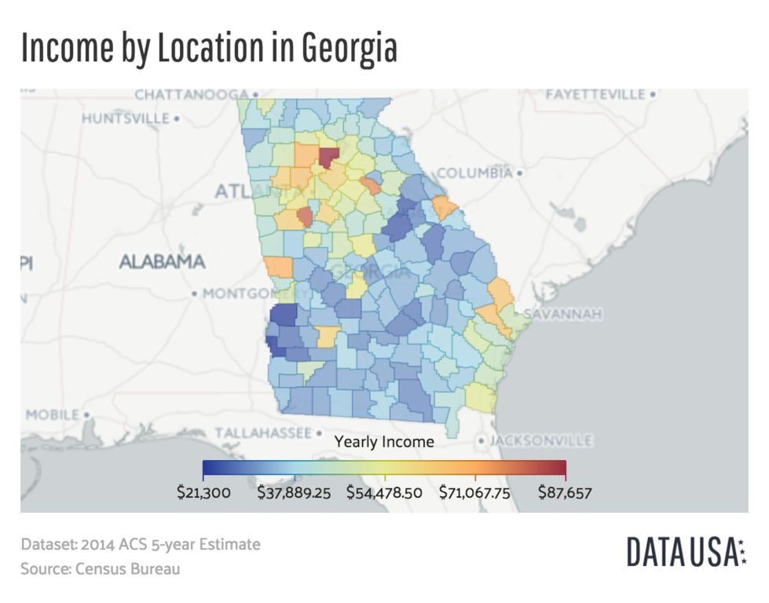

# Data Science for Statistical Learning Final Project: **Predicting Recidivism Rates Using Logistic Regression and Random Forest Models**

### **Team Members:**

Daniel Krasemann, Sam Chotzen, and William DeForest

### **Data**

NIJ_s_Recidivism_Challenge_Full_Dataset - From the National Institute of Justice on roughly 26,000 individuals from the State of Georgia released from Georgia prisons on discretionary parole to the custody of the Georgia Department of Community Supervision (GDCS) for the purpose of post-incarceration supervision between January 1, 2013 and December 31, 2015.

### **Code**

Final_Project.Rmd - Contains the commented code used to make our project. 

Final_Project.Md - Contains our final project output with only results and all code silenced.

### **Final Report**

Final Project PDF - PDF of our final report with all visuals and explanations.

### **Mapping Recidivism**

  

These graphs show the percentage of all, black, and white prisoners from clusters of PUMAs (public use microdata areas) in Georgia who recidivated. The graphs paint a very interesting story. First, we saw that there was a much wider range of recidivism rates for black prisoners depending on where they lived after release. There was a small area in the northwest part of the state where recidivism rates were 40%, while in the northeast, rates reached as high as 72%. This was significantly larger than the range of rates when looking at all and white prisoners who respectively ranged from 50%-68% and 46%-67%. This wider range likely explains why the Residence_PUMA variable was more significant for black prisoners. We could also see from the graphs that recidivism rates overall were higher for black prisoners than white prisoners.

Next, looking at the specific PUMA clusters, we could see that for the most part the areas with high recidivism rates were consistent for both black and white prisoners. The main difference being that the rates of recidivism for black prisoners are pretty much higher across the board. With little familiarity with counties in Georgia, we were curious to compare these graphs with a regular map of Georgia.

 

From these maps we could see that the area around Athens, Georgia had the highest rates of recidivism while Augusta, Georgia had the lowest rates. Looking at the median household income of the different areas in 2014, it's interesting that there didn't really appear to be a huge connection between lower income and higher recidivism. What was even more notable is that Athens is about 63% white and 28% black, while Augusta is 57% black and 36% white (worldpopulationreview.com). These findings suggest that black prisoners are more successful at desisting when living among a community with a higher black population. It also shows that black prisoners had a harder time desisting when living in an area like Athens that had a higher white population. The reasons for these findings could be numerous and much more research needs to be done in this area to confirm and build upon these findings. However, one potential hypothesis could be that black people living in an area with a higher white population might stick out more and be subject to more racial biases and as a result be more prone to being re-arrested.

### **Summary of Findings**

Our project shed light on the important variables in predicting recidivism. Although the accuracy of none of models were impressively high, the closer analysis of the significant variables can be useful to promote higher rates of desistance. We went into the project with the ambition of describing potential programs or areas worth investing man power or capital in to lower rates of recidivism. We came away with the prominent findings that employment, drug use, and geographic location are among the most significant variables in predicting recidivism. Rather than use a predictive model such as the one we created to closely monitor individuals with higher chances of recidivism, states and counties ought to consider the key variables we found when predicting recidivism in order to promote desistance. For employment, perhaps individuals newly-released from prison should receive some sort of capital or social job opportunity. For drug use, individuals should be placed in rehab programs and supported in their battle with drugs. Considering the incarceration system holistically, we found distinctions between white and black prisoners. Racial equality will continue to remain an important ambition of states and societies, and that especially applies to prisons. For geographic location, perhaps the state can work toward equality of opportunity across communities. Working with, rather than against, newly-released prisoners can facilitate a positive feedback loop. Promoting the good rather than preparing for the bad is the solution to lower recidivism rates.

### **Works Cited**

“The Problem: Recidivism & Mass Incarceration.” Prison Scholar Fund, 20 July 2019, https://www.prisonscholars.org/what-we-do/222-2/.

“Recidivism.” National Institute of Justice, U.S. Department of Justice, 31 July 2019, https://nij.ojp.gov/topics/corrections/recidivism.

Wildeman, Christopher. “The Impact of Incarceration on the Desistance Process among Individuals Who Chronically Engage in Criminal Activity.” National Institute of Justice, 14 Oct. 2021, https://nij.ojp.gov/topics/articles/impact-incarceration-desistance-process-among-individuals-who-chronically-engage. 

https://en.wikipedia.org/wiki/Demographics_of_Georgia_(U.S._state)

https://worldpopulationreview.com/us-cities/athens-ga-population

https://worldpopulationreview.com/us-cities/augusta-ga-population

